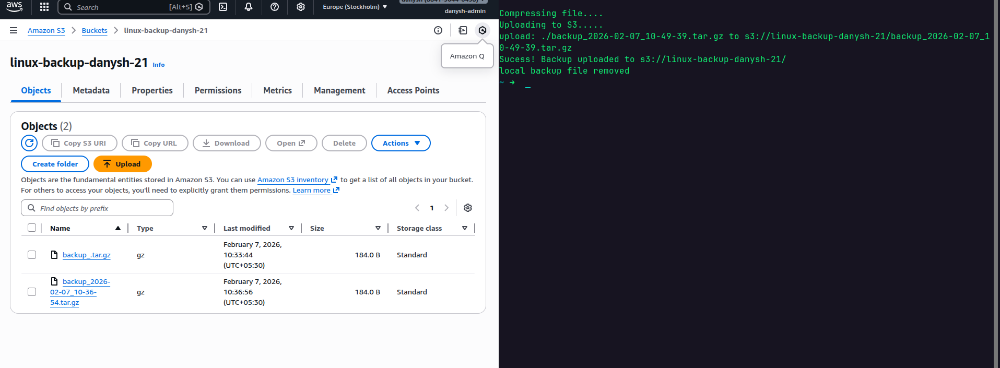

# AWS Hybrid Cloud Backup Tool ☁️

##  Project Overview
A disaster recovery automation tool that compresses critical local data on a Linux server and securely uploads it to an AWS S3 bucket. This ensures data redundancy and off-site storage compliance.

##  Architecture
* **Source:** Linux File System (Ubuntu).
* **Destination:** AWS S3 (Standard Storage Class).
* **Security:** IAM User with restricted `AmazonS3FullAccess` policy.
* **Automation:** Bash script with error handling and local cleanup.

##  Code Highlights
* **Compression:** Uses `tar -czf` to reduce transfer size.
* **AWS CLI:** Integrates `aws s3 cp` for secure transfer.
* **Error Handling:** Implements exit code checks (`$?`) to verify upload success before deleting local artifacts.

##  Usage
1. Configure AWS CLI: `aws configure`
2. Run script: `./backup_to_cloud.sh`

##  Proof

